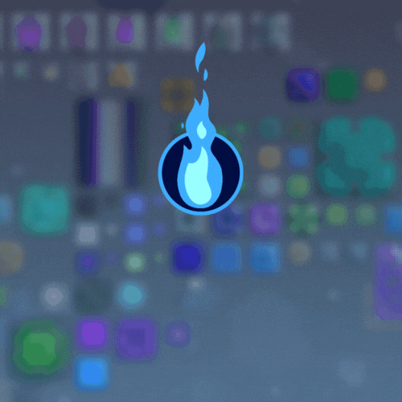

# Better-Blocks-Mod
# Mod Mindustry v6.0

 
  
ENG Description

Better-Blocks-Mod: This mod adds more blocks, materials and enemies (In development).

The mod is developed specifically for EasyPlay.su

For all questions, write to Discord: https://ds.easyplay.su/

Also, everyone can contribute to the development of the mod!
This mod will operate on our server.
The server connection addresses are on the Discord: https://ds.easyplay.su/

Some sprites are present from other modifications
Since I can’t find the authors myself, send me links to repositories in Discord and I will indicate them.

 
  
RUS Description

Better-Blocks-Mod: Этот мод добавляет больше блоков, материалов и врагов(В разаработке).

Мод разрабатывается специально для EasyPlay.su

По всем вопросам пишите в Discord: https://ds.easyplay.su/

Так же все желающие могут внести вклад в развитие мода!
Этот мод будет действовать у нас на сервере.
Адреса подключения к серверам находятся в Discord: https://ds.easyplay.su/

Некоторые спрайты присутствуют с других модификаций
Поскольку авторов я найти сам не могу, то присылайте мне в Discord ссылки на репозитории и я их укажу.

# Developers

- [EasyPlaySu](https://github.com/EasyPlaySu) (Head Developer)
- [MemFaceGo](https://github.com/MemFaceGo) (First Developer)

# Discord Server Banner

